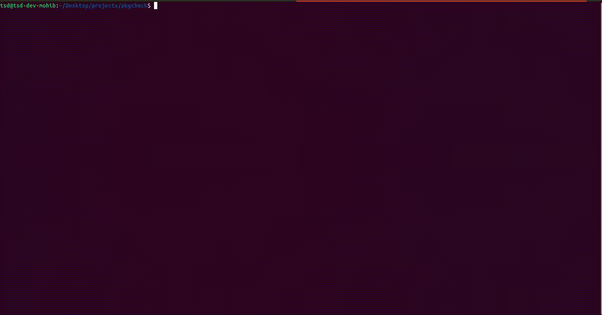

# pkgvet

A pre-flight inspector for npm packages. Downloads and statically analyzes a package
**without executing any code**, then reports what it can touch and how risky it looks.



## Usage

```sh
# Install
npm install -g pkgvet

# Inspect a package
pkgvet inspect <package-spec>

# Or with npx (no install needed)
npx pkgvet inspect <package-spec>
```

### Examples

```sh
# Human-readable report
pkgvet inspect shelljs@0.8.5

# JSON output for scripts/agents
pkgvet inspect shelljs --json

# Fail CI if risk level meets a threshold (exit 1)
pkgvet inspect is0dd --fail-on med

# Opt-in LLM second opinion (requires API key)
pkgvet inspect shelljs --llm
```

### Exit codes

| Code | Meaning |
|---|---|
| `0` | Clean — risk is below threshold (or no threshold set) |
| `1` | Risk meets or exceeds `--fail-on` threshold |
| `2` | Resolution / download / parse failure (never treated as safe) |

## What it checks

The tool runs four static analysis passes on the unpacked package:

| Signal | What it looks for |
|---|---|
| **Manifest** | `preinstall`/`install`/`postinstall` scripts, `deprecated` flag |
| **Publisher** | Version published within last 7 days (new accounts are a risk signal) |
| **Typosquat** | Levenshtein + homoglyph distance to 20 popular package names |
| **Capabilities** | AST analysis of `.js`/`.ts`/`.cjs`/`.mjs` files (`.d.ts` type declarations are skipped) — real call sites, imports, and member access, not text matching — for: `fs:read`, `fs:write`, `net`, `shell`, `env`, `obfuscated` |

Each finding has a weight. The scorer combines them into a 0–100 score and a
`low` / `med` / `high` level, with a bonus for dangerous combinations (e.g.
install script + network + env reads = classic credential exfil shape).

## --llm (second opinion)

Strictly opt-in. Set one of these environment variables:

| Env var | Provider | Model | Cost |
|---|---|---|---|
| `ANTHROPIC_API_KEY` | Anthropic | `claude-opus-4-8` | Paid |
| `OPENAI_API_KEY` | OpenAI | `gpt-5.5` | Paid |
| `GROQ_API_KEY` | Groq | `llama-3.3-70b-versatile` | Free |
| `GEMINI_API_KEY` | Gemini | `gemini-2.0-flash` | Free |

The tool sends only the package name, version, risk level, and detected
capabilities (no source code). Each call is capped at 100 output tokens with
a 15-second timeout. A failing or missing API key is silently ignored — it
never changes the deterministic score, verdict, or exit code.

## Principles

- **Never executes the package.** Static analysis only.
- **Offline, free, and deterministic by default.** The `--llm` pass is opt-in.
- **Conservative weighting.** A benign library that only reads files stays `LOW`.
  Risk is driven by dangerous *combinations*, not single capabilities.

## Security model & dependencies

**What pkgvet protects you from:** the package you point it at. It is downloaded
and read as bytes and ASTs — never `require`d, `import`ed, `eval`d, or run, and
its lifecycle scripts are never executed. A malicious *target* package cannot
run code through pkgvet, and tarball extraction is guarded against path
traversal (zip-slip).

**What it does not protect you from: itself.** Like any tool, pkgvet runs its own
dependencies in-process. Today it depends on [`pacote`](https://www.npmjs.com/package/pacote)
(npm's own package fetcher) for resolution and extraction, which pulls in a large
transitive tree. `npm audit` currently reports advisories in that tree
(`tar`, `node-gyp`, `sigstore`, `make-fetch-happen`, …). Being transparent about
this rather than hiding it:

- They are **transitive through `pacote`**, with **no upstream fix available**
  (the advisory ranges cover even the latest versions), so they can't be
  resolved by version bumps or `overrides` yet.
- Most are **unreachable for this tool** — e.g. `node-gyp` only runs when
  building native modules during `npm install`, which pkgvet never does — and
  the rest operate on tarballs fetched from the official registry over HTTPS
  that are never executed.
- Dependencies are **pinned with integrity hashes** in `package-lock.json`;
  install with `npm ci` to install strictly from the lockfile.

Shrinking this dependency surface (replacing `pacote` with lighter primitives)
is on the roadmap — for a security tool, a small, auditable dependency tree is
itself a security property.

**The ceiling of static analysis:** pkgvet reports *what a package can do*, not a
guarantee that it is safe. Sufficiently obfuscated or dynamically-constructed
code can hide intent from any static scanner — which is why heavy obfuscation is
itself flagged. Treat the verdict as a strong signal, not a proof.

## Install

```sh
npm install -g pkgvet
npm run build    # compile TypeScript to dist/
```

Requires Node >= 18.

## License

MIT
